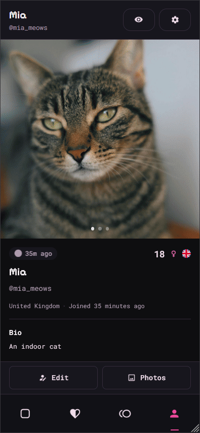
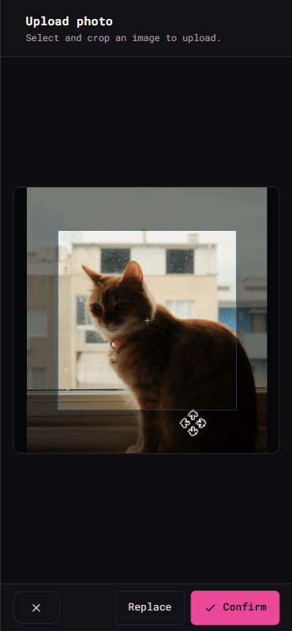
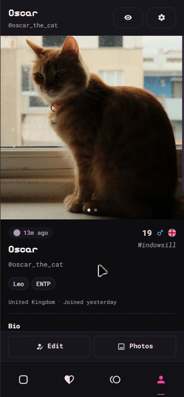

  

# loopii-frontend

loopii is a social matchmaking app for discovering and connecting with people online and linking up through your socials. The core mechanic is the **loop**: when two people mutually choose to connect, they unlock each other's **loops-only** content:
- a configurable loops-only bio
- a private list of socials to copy and connect off-platform

There's currently no in-app messaging. loopii matches you, then you connect elsewhere. You have full control over who you see in your feed, who can see you in their feed, and who you loop with.

This repository is the **public frontend**. The backend is private, so this README includes the system overview and integration details for both.

## Contents
- [Services / domains](#services--domains)
- [Demo](#demo-ui--flows)
- [Repo layout](#repo-layout-high-level)
- [Core concepts](#core-concepts)
- [System architecture](#system-architecture-frontend--backend)
- [Privacy](#privacy--control-model)
- [License](#license)

---

## Services / domains

- App: `https://loopii.app`
- API: `https://api.loopii.app`
- Email: `mail.loopii.app`

---

## Demo (UI + flows)

### Account settings: password, email, sessions, deletion (`/settings`)

Features:
- Changing password.
- Changing email (double-confirmation via inbox links).
- Revoking sessions across devices.
- Deleting the account.

Captchas may sometimes be required.

---

### Responsive UI: mobile vs desktop behavior

Features:
- Layout scaling between mobile and desktop.
- Navbar relocates to the bottom on mobile.
- Modals/overlays adapt between fullscreen (mobile) and windowed (desktop).
- Smooth UI scaling via media queries.
- Hover effects disabled on touch devices to avoid sticky buttons.

---

### Appearance: themes + styles (`/settings`)

Features:
- Multiple built-in light and dark themes.
- Optional sans-serif font toggle (alternative to the default pixel/mono styling).
- Access via `/settings` or Quick Settings during account setup.

---

### Create profile: first-time setup flow

Features:
- Account creation leads into a guided profile setup.
- Photo upload, profile fields, interests, loops-only content.
- Search preferences setup (who appears in your feed).

Notes:
- Search preferences configure who *you see*; visibility rules configure who can *see you*.
- Setup is designed to complete safely even if a non-critical step fails (e.g. missing interests).

---

### Photos: upload, crop, set profile pic, delete (`/profile/photos`)

Features:
- Upload from device.
- Crop + scale before upload (uses CropperJS).
- Optionally set as the profile picture.
- Manage photos (change profile picture, delete).
- Profile view with a scrollable photo carousel.

Notes:
- Images are consistently cropped to squares for layout stability.

---

### Edit profile: form and custom overlays (`/profile/edit`)

Features:
- Full profile edit form (bio, looking for, etc.).
- Voice intro recording.
- Interests selection via a custom multiselect overlay.
- Location selection via a custom Leaflet-based overlay.
- Add, remove or edit socials (loops-only).

Location behavior:
- Intended to be approximate and rounded for privacy.
- Enables location/distance search/visibility filters.
- Without a location, you will not appear in others' location-based searches.
- "Country" is a separate profile attribute users can filter by.
- Location can be anywhere (doesn't need to match the chosen country).

Cooldown fields (restricted edit frequency):
- username
- date of birth
- country
- gender

---

### Visibility preferences: who can see *you* (`/profile/visibility-preferences`)

Features:
- Global visibility toggle (pseudo-deactivate):
  - hides you from the feed (loops can still see you).
  - when hidden, you also can't browse the feed.
- Visibility filters:
  - age range
  - country
  - gender
  - distance from a pinned map location

Notes:
- Visibility rules are symmetric. If you hide your profile from a group, you can't see them in your feed either.

---

### Feed decisions + search preferences (`/` and `/profile/search-preferences`)

Features:
- Main feed at `/`.
- Shows a public view of profiles matching your filters (no loops-only content).
- Choosing to connect or pass.
- Smooth feed scrolling - backend supplies profiles in batches.
- Search preferences page can be accessed from the feed header to filter your feed.

Notes:
- Search preferences apply in addition to visibility rules, and the same filters are available.

---

### Requests: notification => accept/decline (`/requests`) => loop (`/loops`)

Features:
- Notifications for loop requests and new loops, delivered via subscription.
- Expanding a request to view the requester and accept/decline the request.
- Accepted request becomes a loop - enabling loops-only visibility (socials).

---

## Repo layout

- `src/routes/*`  -  pages (feed, profile, requests, settings)
- `src/lib/components/*`  -  UI components (cards, overlays, pickers, navbar)
- `src/lib/stores/*`  -  app state (auth, profile, feed, notifications, loops, requests)
- `src/lib/api/*`  -  API access (account, profile, prefs, feed, requests, uploads)
- `src/lib/utils/*`  -  validation, normalization, env, captcha helpers
- `src/lib/styles/*`  -  CSS tokens + layout + component styling
- `static/*`  -  icons, logos, robots.txt
- `readme/*`  -  readme content

---

## System architecture

### Frontend (this repo)
- Svelte (routing under `src/routes`).
- State handled via stores (`src/lib/stores`).
- API modules grouped in `src/lib/api`.
- Client-side validation + normalization:
  - forms block invalid submissions using derived states.
  - inputs normalized before sending.
- Auth + profile gating:
  - authentication required for all pages.
  - profile required to enter the app.
- Real-time notifications powered by subscriptions on database tables.

### Backend (private)
- FastAPI (Python).
- SQLAlchemy for database queries.
- Supabase
  - Postgres database with RLS and real-time rules for subscriptions.
  - storage buckets and media pipelines (profile photos + voice intros).
  - backend owns reads / writes.
- Endpoints gated behind auth and dependencies.
  - users can only act on their own behalf.
- Access control enforced by Pydantic request and response shaping:
  - loops-only fields are only returned to authorized (looped) users.

---

## Privacy & control model

- **Loops-only access control**: socials + loops-only content are only returned to authorized looped users.
- **Location privacy**: map pin is intended to be approximate and is rounded before use.
- **Symmetric discovery rules**: if you exclude a group from seeing you, you also won't see them.
- **No in-app messaging**: loopii is a matchmaker - users connect via socials off-platform.

---

## License
All rights reserved. See `LICENSE`.

Contact: https://github.com/haroldini

